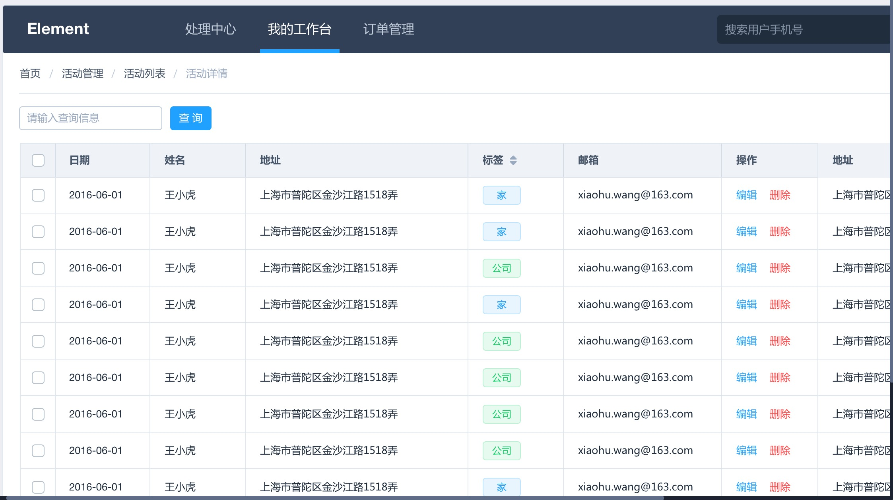

# Element
[](https://travis-ci.org/ElemeFE/element)
[](https://www.npmjs.org/package/element-ui)
[](https://npmjs.org/package/element-ui)
[](https://gitter.im/ElemeFE/element?utm_source=badge&utm_medium=badge&utm_campaign=pr-badge&utm_content=badge)

> Desktop UI elements for Vue.js 2.0.

## Docs

Coming soon

## Demo
Demo will come with the documentation. Here is a preview of what a page based on Element looks like:



## Usages
```shell
npm install element-ui@next -S
```

## Quick Start
use [babel-plugin-component](https://github.com/QingWei-Li/babel-plugin-component)

``` javascript
import Vue from 'vue'
import Element from 'element-ui'

Vue.use(Element)

// or
import {
  Select,
  Button
  // ...
} from 'element-ui'

Vue.component(Select.name, Select)
Vue.component(Button.name, Button)
```

(roughly) to

``` javascript
import Vue from 'vue'
import Element from 'element-ui'
import 'element-ui/lib/theme-default/index.css'

Vue.use(Element)

// or
import Select from 'element-ui/lib/select'
import 'element-ui/lib/theme-default/select.css'
import Button from 'element-ui/lib/button'
import 'element-ui/lib/theme-default/button.css'

Vue.component(Select.name, Select)
Vue.component(Button.name, Button)
```

## babel-plugin-component
.babelrc
```json
{
  "plugins": ["xxx", ["component", [
    {
      "libraryName": "element-ui",
      "styleLibraryName": "theme-default"
    }
  ]]]
}
```

## Development
Recommend: node >= 4 npm >= 3

```shell
# development => install packages -> build icon etc. -> run webpack
$ npm run dev

# build => build all component
$ npm run dist
```

## Other links
- [Design resources](https://github.com/ElementUI/Resources)
- Boilerplate for bug reports
 - [CodePen](https://codepen.io/anon/pen/ozYpNA)
 - [JSFiddle](https://jsfiddle.net/gmve9d3p/)
- [Mint UI](https://github.com/ElemeFE/mint-ui) - Mobile UI elements for Vue.js

## Changelog
Details changes for each release are documented in the [release notes](https://github.com/ElemeFE/element/releases).

## Contribution
Please make sure to read the [Contributing Guide](https://github.com/ElemeFE/element/blob/master/.github/CONTRIBUTING.md) before making a pull request.

## LICENSE
MIT


