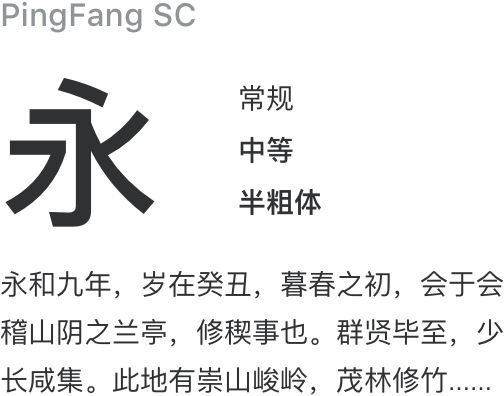

<script>
  import bus from '../../bus';
  import { ACTION_USER_CONFIG_UPDATE } from '../../components/theme/constant.js';
  const varMap = [
    '$--font-size-extra-large',
    '$--font-size-large',
    '$--font-size-medium',
    '$--font-size-base',
    '$--font-size-small',
    '$--font-size-extra-small'
  ];
  const original = {
    'font_size_extra_large': '20px',
    'font_size_large': '18px',
    'font_size_medium': '16px',
    'font_size_base': '14px',
    'font_size_small': '13px',
    'font_size_extra_small': '12px'
  }
  export default {
    created() {
      bus.$on(ACTION_USER_CONFIG_UPDATE, this.setGlobal);
    },
    mounted() {
      this.setGlobal();
    },
    methods: {
      tintColor(color, tint) {
        return tintColor(color, tint);
      },
      setGlobal() {
        if (window.userThemeConfig) {
          this.global = window.userThemeConfig.global;
        }
      }
    },
    data() {
      return {
        global: {},
        'font_size_extra_large': '',
        'font_size_large': '',
        'font_size_medium': '',
        'font_size_base': '',
        'font_size_small': '',
        'font_size_extra_small': ''
      }
    },
    watch: {
      global: {
        immediate: true,
        handler(value) {
          varMap.forEach((v) => {
            const key = v.replace('$--', '').replace(/-/g, '_')
            if (value[v]) {
              this[key] = value[v]
            } else {
              this[key] = original[key]
            }
          });
        }
      }
    },
  }
</script>

## Typography 字体

我们对字体进行统一规范，力求在各个操作系统下都有最佳展示效果。

### 字体
<div class="demo-term-box">



</div>

### 字号

<table class="demo-typo-size">
  <tbody>
  <tr
    >
      <td>层级</td>
      <td>字体大小</td>
      <td class="color-dark-light">举例</td>
    </tr>
    <tr
    :style="{ fontSize: font_size_extra_small }"
    >
      <td>辅助文字</td>
      <td class="color-dark-light">{{font_size_extra_small}} Extra Small</td>
      <td>用 Element 快速搭建页面</td>
    </tr>
    <tr
    :style="{ fontSize: font_size_small }"
    >
      <td>正文（小）</td>
      <td class="color-dark-light">{{font_size_small}} Small</td>
      <td>用 Element 快速搭建页面</td>
    </tr>
    <tr
    :style="{ fontSize: font_size_base }"
    >
      <td>正文</td>
      <td class="color-dark-light">{{font_size_base}} Base</td>
      <td>用 Element 快速搭建页面</td>
    </tr>
    <tr
    :style="{ fontSize: font_size_medium }"
    >
      <td>小标题</td>
      <td class="color-dark-light">{{font_size_medium}} Medium</td>
      <td>用 Element 快速搭建页面</td>
    </tr>
    <tr
    :style="{ fontSize: font_size_large }"
    >
      <td>标题</td>
      <td class="color-dark-light">{{font_size_large}} large</td>
      <td>用 Element 快速搭建页面</td>
    </tr>
    <tr
    :style="{ fontSize: font_size_extra_large }"
    >
      <td>主标题</td>
      <td class="color-dark-light">{{font_size_extra_large}} Extra large</td>
      <td>用 Element 快速搭建页面</td>
    </tr>
  </tbody>
</table>

### 行高

<div>

<ul class="lineH-right">
<li>line-height:1 <span>无行高</span></li>
<li>line-height:1.3 <span>紧凑</span></li>
<li>line-height:1.5 <span>常规</span></li>
<li>line-height:1.7 <span>宽松</span></li>
</ul>
</div>

### Font-family 代码

```css
font-family: "Helvetica Neue",Helvetica,"PingFang SC","Hiragino Sans GB","Microsoft YaHei","微软雅黑",Arial,sans-serif;
```
